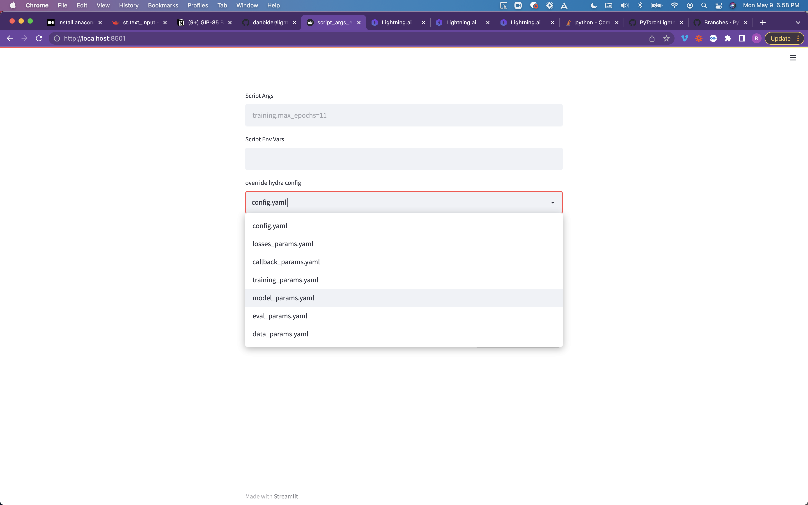
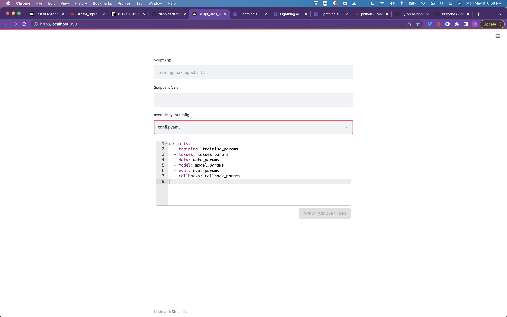
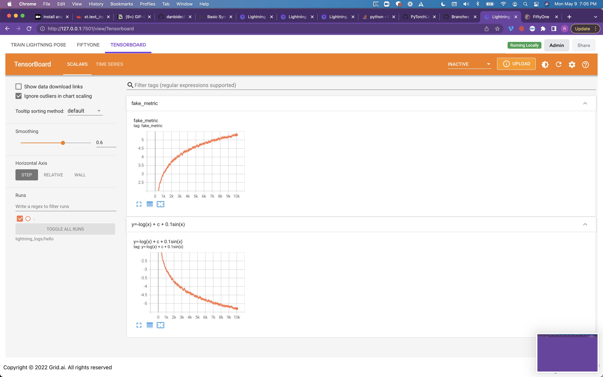

# Lightning Pose App

App for:
* Annotating keypoints on images
* Training a model to predict keypoints (after configuring it)
* Predicting keypoints on images and videos
* Looking at diagnostics via Tensorboard and FiftyOne
* More to come! (Deploying for new videos, active learning, etc.)

## Installation
For now, the installation assumes a local editable installation of `lightning` and `lightning-pose` (the latter skips the `DALI` installation).
### Conda environment
Create a `conda` environment and `cd` into it:
```bash
conda create --name lit-app python=3.8
cd lit-app
```

### Install `lightning-pose`
We clone lightning and install it with its dependencies in editable mode
```bash
git clone https://github.com/danbider/lightning-pose
cd lightning-pose
pip install -e .
```
NOTE: we're skipping the usual `pip install -r requirements.txt` avoiding `DALI` install. 

### Install `lightning` (beta)
Following the instructions here:

```bash
git clone https://github.com/PyTorchLightning/lightning.beta.git
```
Install dependencies:
```bash
pip install -r requirements.txt
pip install -e .
```
Move into folder
```bash
cd lightning
```
Download the `lightning` UI:
```bash
python scripts/download_frontend.py
```

### Locally

In order to run the application locally, run the following commands

```
pip install -r requirements.txt
lightning run app app.py
```

### Cloud

In order to run the application cloud, run the following commands

### On CPU

```
lightning run app app.py --cloud
```

### On GPU

```
USE_GPU=1 lightning run app app.py --cloud
```

# Unit Test

Each of the individual components can be tested individually before `LightingFlow` is used to stitched into `Lightning App`

- arguments: `python -m streamlit run script_args_editconfig.py -- --dir ~lightning-pose/scripts/configs` 
  - The Hydra config are in pull down. 
  - Each can be edited in the text panel.
  


- tensorboard: `python run_fo.py`
  
  
- fiftyone: `python run_tb.py`
  
